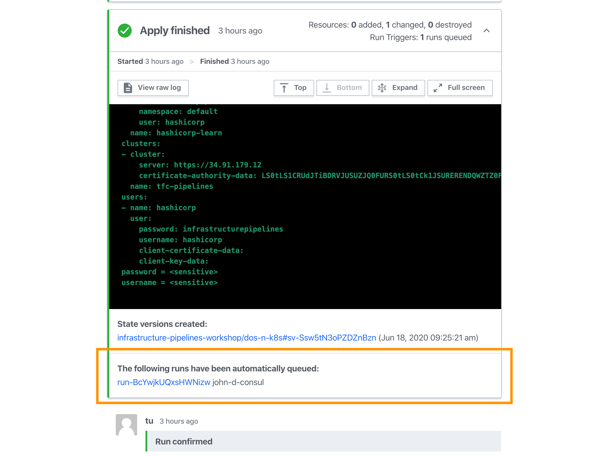

## Deploy Kubernetes, Consul, and Vault

Now that you have successfully configured all three workspaces (Kubernetes, Consul, and Vault), you can deploy your Consul instance and Vault instance.

Verify that your Kubernetes cluster has been provisioned before starting this guide.

## Enable Consul and Vault

Now that your Kubernetes cluster has been provisioned, you will deploy Consul and Vault on your cluster.

Navigate to your Kubernetes workspace. Click on "Configure variables" then set the Terraform variable `enable_consul_and_vault` to `true`.

Click "Queue plan". In the run plan, note that the cluster will scale from 3 to 5 nodes. Click "Confirm & Apply" to scale your cluster.

This process should take about 5 minutes to complete.

Notice that a plan for your Consul workspace will be automatically queued once the apply completes.

## Deploy Consul

Navigate to the Consul workspace, view the run plan, then click "Confirm & Apply". This will deploy Consul onto your cluster using the Helm provider. The plan retrieves the Kubernetes cluster authentication information from the Kubernetes workspace to configure both the Kubernetes and Helm provider.

This process will take about 2 minutes to complete.

Notice that a plan for your Vault workspace will be automatically queued once the apply completes.

## Deploy Vault

Navigate to the Vault workspace, view the run plan, then click "Confirm & Apply". This will deploy Vault onto your cluster using the Helm provider and configure it to use Consul as the backend. The plan retrieves the Kubernetes namespace from the Consul workspace’s remote state and deploys Vault to the same workspace.

This process will take about 2 minutes to complete.

## Next steps

Congratulations — you have successfully completed the scenario and applied some Terraform Cloud best practices. By keeping your infrastructure configuration modular and integrating workspaces together using run triggers, your Terraform configuration becomes extensible and easier to understand.

Return to the main Zoom meeting for the group Q&A session.
