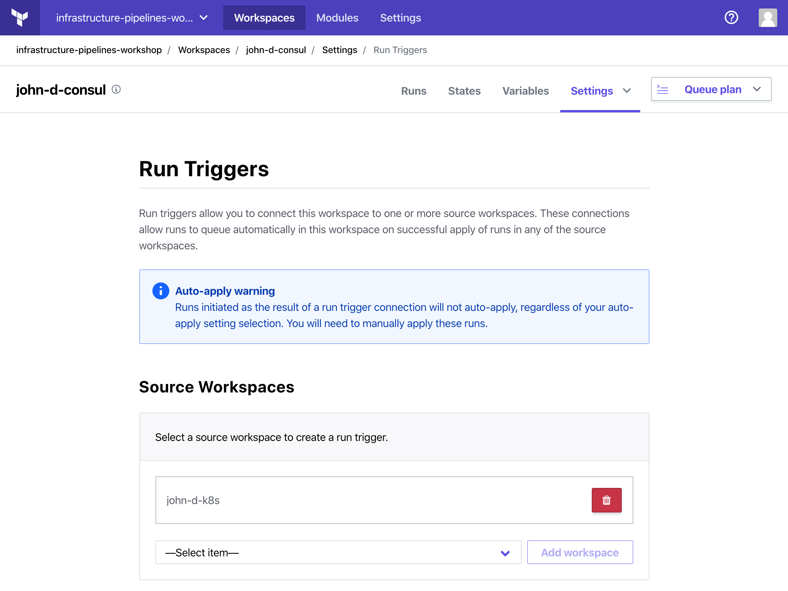

## Configure the Consul workspace

Configure the Consul GitHub repository and workspace by following a similar set
of sets as you did for your Kubernetes workspace.

1. Fork the [Learn Terraform Pipelines Consul
   repository](https://github.com/hashicorp/learn-terraform-pipelines-consul)
   into your own GitHub account using the `fork` interface in GitHub.
1. In your forked repository, navigate to `main.tf`.
1. Use the "pencil"/edit button to edit the file.
1. Replace the `organization` and `workspaces` values in `main.tf`.   
  - `organization = "infrastructure-pipelines-workshop"`
  - `workspaces   = "{firstName}-{lastInitial}-consul"`
  ```hcl
  terraform {
    backend "remote" {
      organization = "infrastructure-pipelines-workshop"

      workspaces {
        name = "john-d-consul"
      }
    }
  }
  ```
1. Commit your changes directly to the "master" branch of your forked
   repository.

Now that your GitHub repository is configured for use with the Terraform Cloud
workspace, connect them in the Terraform Cloud UI.

### Connect workspace to forked repository

Visit the [Terraform Cloud
UI](https://app.terraform.io/app/infrastructure-pipelines-workshop).

1. Select your Consul workspace ("john-d-consul").
1. Within the workspace UI, click on "Settings" and then "Version Control".
  
1. Click on "Connect to version control" and choose "Version control workflow".
1. Select "Github".
1. Select your **forked** Consul repository:
  `{your-github-username}/learn-terraform-pipelines-consul`.
1. Click "Update VCS settings" to connect this workspace to your forked GitHub
   repository.

In addition to the steps above, which you followed for the Kubernetes workspace,
you will need to include submodules from the consul repository.

1. Select "Include submodules on clone", and then click on "Update VCS
   settings". 


### Verify variables

Next, click on "Variables". Your Terraform Variables will already be set for
you. These correspond with the variables in
[`variables.tf`](https://github.com/hashicorp/learn-terraform-pipelines-consul/blob/master/variables.tf).

Verify that these variables are set correctly before moving on.

#### Terraform Variables

- **namespace** — Kubernetes namespace to deploy the Consul Helm chart<br/>
  This will be set to `hashicorp-learn`. You will use this to access your Consul
  and Vault instances later.
- **organization** - Organization of workspace that created the Kubernetes cluster<br/>
  This will be set to `infrastructure-pipelines-workshop`.
- **release_name** — Helm Release name for Consul chart<br/>
  This will be set to `hashicorp-learn`. Your Vault pods will start with this
  release name.
- **cluster_workspace** — Workspace that created the Kubernetes cluster<br/>
  This will be set to something similar to `{firstName}-{lastInitial}-k8s`
  (`john-d-k8s`).

### Enable run trigger

In the Workspace UI, click on "Settings" and then select "Run Triggers".

Under "Source Workspaces", select your Kubernetes workspace ("john-d-k8s") then
click "Add Workspace".



Setting a run trigger means that whenever the Kubernetes workspace is applied,
Terraform Cloud will trigger an apply run on the consul workspace.

## Next steps

You have successfully configured your Consul workspace. The pipeline will retrieve the Kubernetes credentials from the Kubernetes workspace to authenticate to the Kubernetes and Helm provider.

In the next step, you will configure your Vault workspace.
